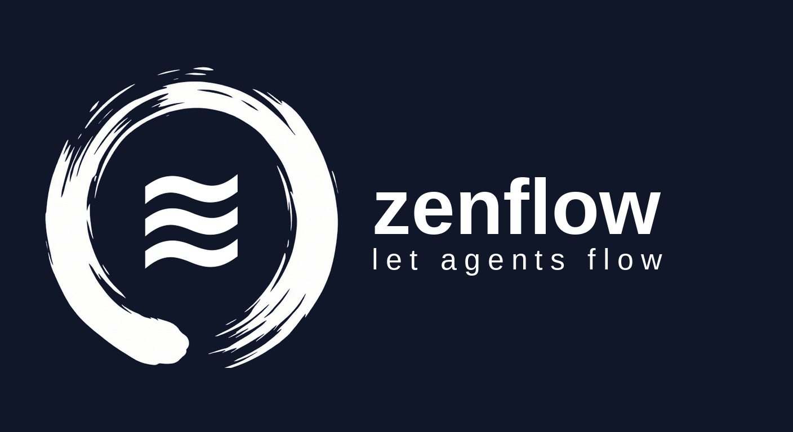

<p align="center">
  
</p>

<h1 align="center">zenflow</h1>

<p align="center"><em>Multi-agent orchestration & workflow engine.</em></p>

<p align="center">Declarative YAML agent workflows. An LLM coordinator routes events through hub-and-spoke mailboxes with race-safe delivery and zero-data-loss recovery. One YAML file, one ~20 MB Go binary. Runs on any provider <a href="https://goai.sh">goai</a> supports.</p>

<p align="center">
  <a href="https://codecov.io/gh/zendev-sh/zenflow"></a>
  <a href="https://github.com/zendev-sh/zenflow/releases/latest"></a>
  <a href="https://pkg.go.dev/github.com/zendev-sh/zenflow"></a>
  <a href="LICENSE"></a>
</p>

<p align="center">
  <a href="https://zenflow.sh">Website</a> &middot;
  <a href="https://zenflow.sh/getting-started/quick-start">Docs</a> &middot;
  <a href="https://zenflow.sh/architecture">Architecture</a> &middot;
  <a href="https://zenflow.sh/yaml/">YAML Reference</a> &middot;
  <a href="https://zenflow.sh/examples">Examples</a>
</p>

---

## See it run

<p align="center">
  <!---->
  <a href="https://asciinema.org/a/T6ghM70jlJEth4Ez" target="_blank"></a>
</p>

A real `zenflow flow spec/v1/examples/full-featured.yaml --model google/gemini-3-flash-preview --workdir /tmp/full-feature-gemini --yolo --plan` run. The `--plan` flag prints the DAG before execution; the coordinator narrates every step boundary; four agents (planner, coder, reviewer, deployer) call `read` / `write` / `glob` / `grep` / `bash` tools to plan, implement, review, and ship a feature; the `deploy_staging` sub-workflow (loaded via `includes:`) runs after the main DAG completes. The cast that produced this recording is pinned at [`demos/full-featured.cast`](https://github.com/zendev-sh/zenflow/blob/main/demos/full-featured.cast) - replay it locally with `asciinema play demos/full-featured.cast`.

## Core features

- **Declarative YAML agent workflows.** Multi-agent workflows expressed in a small composable spec: steps, dependencies, parallel fan-out, conditions (CEL), loops (`forEach`, repeat-until via `untilAgent`/`maxIterations`), and `includes` for sub-workflow reuse.
- **LLM coordinator with hub-and-spoke messaging.** A coordinator agent narrates progress, forwards events between running steps, and finalizes the run. Peer agents never address each other directly.
- **Race-safe Mailbox + Wake delivery.** Every message is delivered through a per-agent mailbox with explicit drop reasons. No silent loss, no out-of-order delivery, no leaked goroutines.
- **Multi-provider verified.** Verified against Google `gemini-3-pro-preview`, AWS Bedrock (`anthropic.claude-sonnet-4-6`, `minimax.minimax-m2.5`), and Azure (`DeepSeek-V3.2`, `claude-sonnet-4-6`, `gpt-5`, `gpt-5.3-codex`) - any model [goai](https://goai.sh) supports works.
- **Spec-first.** Workflows validate against [`spec/v1/schema.json`](https://github.com/zendev-sh/zenflow/blob/main/spec/v1/schema.json) plus a Go validator with 40+ conformance fixtures BEFORE the first LLM call. Cycles, missing dependencies, unknown agents, malformed CEL - all rejected in milliseconds, not after a minute of model burn.
- **Embed anywhere.** CLI for one-shot runs (`zenflow flow`, `zenflow goal`, `zenflow agent`); Go library primitives (`zenflow.New`, `Orchestrator.RunFlow`) for embedding inside long-running services. Ships as a single static Go binary - no JVM, no Python interpreter, no Node runtime. `go install`, `brew install`, or `curl | sh` and you're running.

## Install

The fastest path is the install script - it picks the right archive for your OS+arch from the latest GitHub Release, verifies the SHA-256 checksum, and drops `zenflow` into `~/.local/bin` (or `%LOCALAPPDATA%\Programs\zenflow` on Windows).

```bash
# macOS / Linux
curl -fsSL https://zenflow.sh/install.sh | sh
```

```powershell
# Windows (PowerShell)
iwr -useb https://zenflow.sh/install.ps1 | iex
```

Other options:

```bash
# Docker (linux/amd64 + linux/arm64 multi-arch image on GHCR)
docker pull ghcr.io/zendev-sh/zenflow:latest
docker run --rm -e GEMINI_API_KEY -v "$PWD":/wd -w /wd \
  ghcr.io/zendev-sh/zenflow:latest flow workflow.yaml

# Homebrew (macOS / Linux)
brew install zendev-sh/tap/zenflow

# Go install
go install github.com/zendev-sh/zenflow/cmd/zenflow@latest

# Manual download
# https://github.com/zendev-sh/zenflow/releases/latest
```

Requires Go 1.25+ when installing via `go install` or building from source. The Docker image runs as the distroless `nonroot` user and ships a static `zenflow` binary, no shell.

## Quick start

Drop a workflow into a YAML file:

```yaml
# debate.yaml
name: debate
agents:
  pro:    { description: "Argues IN FAVOR of the proposition." }
  con:    { description: "Argues AGAINST the proposition." }
  judge:  { description: "Impartial judge declaring a winner." }

steps:
  - id: team-pro
    agent: pro
    instructions: "Argue: 'AI assistants will replace junior dev roles within 5 years.'"

  - id: team-con
    agent: con
    instructions: "Argue against the same proposition."

  - id: verdict
    agent: judge
    instructions: "Declare a winner with reasoning."
    dependsOn: [team-pro, team-con]
```

Run it from the CLI:

```bash
export GEMINI_API_KEY=...
zenflow flow debate.yaml
```

For automated CI runs where you want to block shell access, add `--sandbox`:

```bash
zenflow flow debate.yaml --sandbox --model google/gemini-2.5-flash
```

`--sandbox` restricts tools to `read`, `write`, `grep`, and `glob`; `bash` is blocked even if `--allow bash` is also passed. See the [CLI reference](https://zenflow.sh/cli/flags) for the full permission flag set (`--yolo`, `--allow`, `--deny`, `--strict`).

Or embed in Go:

```go
package main

import (
    "context"
    "fmt"
    "log"
    "os"

    "github.com/zendev-sh/goai/provider/google"
    "github.com/zendev-sh/zenflow"
)

func main() {
    wf, err := zenflow.LoadWorkflow("debate.yaml")
    if err != nil {
        log.Fatal(err)
    }

    llm := google.Chat("gemini-2.0-flash", google.WithAPIKey(os.Getenv("GEMINI_API_KEY")))
    orch := zenflow.New(
        zenflow.WithModel(llm),
        zenflow.WithCoordinator(zenflow.NewDefaultCoordRunner(llm)),
    )
    defer orch.Close()

    result, err := orch.RunFlow(context.Background(), wf)
    if err != nil {
        log.Fatal(err)
    }

    fmt.Println(result.Summary)
}
```

See [`examples/`](https://github.com/zendev-sh/zenflow/tree/main/examples) for 19 runnable Go embeddings and [`spec/v1/examples/`](https://github.com/zendev-sh/zenflow/tree/main/spec/v1/examples) for the matching YAML.

## Three modes

zenflow exposes the same engine through three CLI verbs and one Go library surface:

| Mode | What it does | Use when |
| --- | --- | --- |
| `zenflow flow workflow.yaml` | Runs a fully-declared YAML DAG to completion. | The plan is fixed up-front; you want a deterministic execution. |
| `zenflow goal "build a thing"` | Asks the coordinator to plan and run a workflow on the fly. | The plan must adapt to user input or interim results. |
| `zenflow agent "<prompt>"` | Single-agent chat with optional tool loop. | One-shot agent calls; reuses zenflow's lifecycle hooks and provider routing. |

The library form (`zenflow.New(...).RunFlow(ctx, wf)`) is the same engine; the CLI is a thin wrapper that resolves a provider from `--model`, wires the coordinator, and prints results.

## Documentation

| Section | What's there |
| --- | --- |
| [Getting Started](https://zenflow.sh/getting-started/quick-start) | Install, first workflow, three-mode walkthrough. |
| [Architecture](https://zenflow.sh/architecture) | DAG executor, coordinator, Router, Mailbox, delivery engine (internal), lifecycle. |
| [Concepts](https://zenflow.sh/concepts/) | Agents, scheduling, coordinator, messaging, failure handling, isolation, shared memory, observability, loops, conditions, composition, structured output, tools. |
| [YAML Reference](https://zenflow.sh/yaml/) | Workflow / agent / step / loop schemas + CEL expression reference. |
| [CLI Reference](https://zenflow.sh/cli/) | Commands, flags, output formats. |
| [Integrations](https://zenflow.sh/integrations/) | CI/CD, Docker, scripting, observability (OTel / Langfuse / Jaeger / Datadog). |
| [Go API](https://zenflow.sh/api/) | Core functions, options (49 `With*` constructors), types, errors. |
| [Examples](https://zenflow.sh/examples) | 19 worked examples covering every primitive. |
| [SKILL.md](SKILL.md) | Top-of-funnel context for AI agents that consume zenflow (tool description, env vars, YAML shape, NDJSON event schema, exit codes, decision flow). Follows the AI-skill format convention; reusable by any agent harness. |

## Compared to other multi-agent frameworks

zenflow takes a narrower position than CrewAI, AutoGen, and LangGraph: workflows are declarative YAML rather than Python control flow; messaging is mediated by a single coordinator instead of peer-to-peer; delivery is race-safe by construction via a mailbox + wake registry. See [Compare](https://zenflow.sh/compare) for a side-by-side covering the tradeoffs each design makes.

## Contributing

See [CONTRIBUTING.md](CONTRIBUTING.md) for dev setup, build/test commands, and the PR process.

AI contributors: two files cover different audiences and should not be confused.

- [AGENTS.md](AGENTS.md) (regenerated from [CLAUDE.md](CLAUDE.md) by `scripts/sync-agents-md.sh`; pre-commit hook keeps them in sync) - instructions for AI agents **editing** the codebase. Code style, package layout, key rules, testing levels.
- [SKILL.md](SKILL.md) - context for AI agents **consuming** zenflow as a tool. CLI verbs, env vars, YAML shape, NDJSON event schema, exit codes.

## Community

- [Code of Conduct](CODE_OF_CONDUCT.md) - the standards we expect from all contributors and how to report violations.
- [Security Policy](SECURITY.md) - private vulnerability disclosure process; do **not** open a public issue for security reports.

## License

[Apache 2.0](LICENSE).
